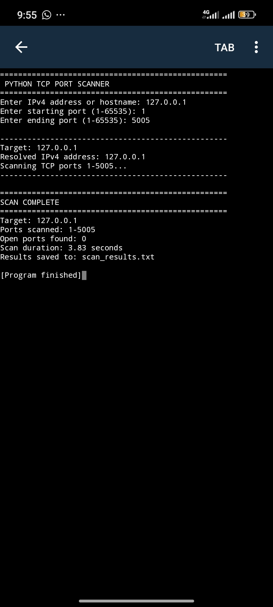
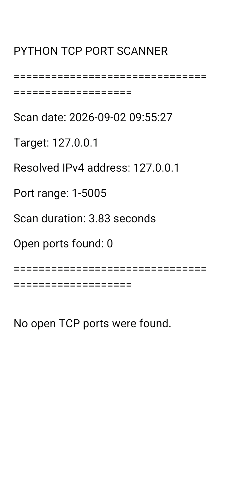
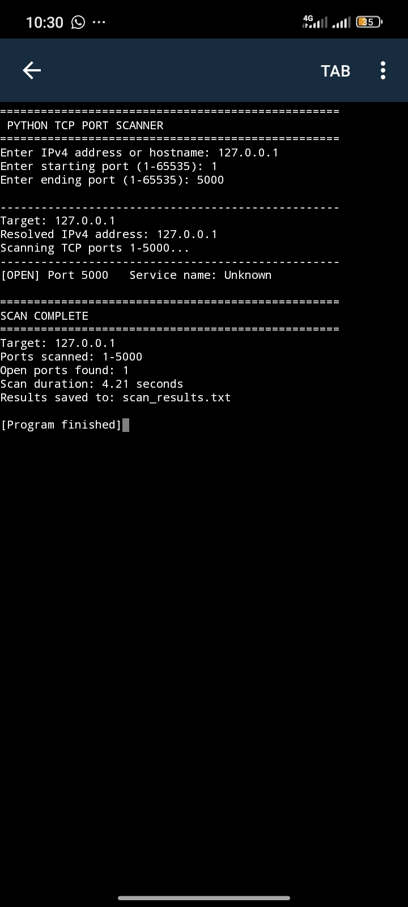
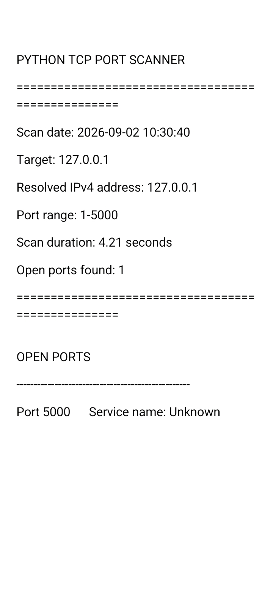
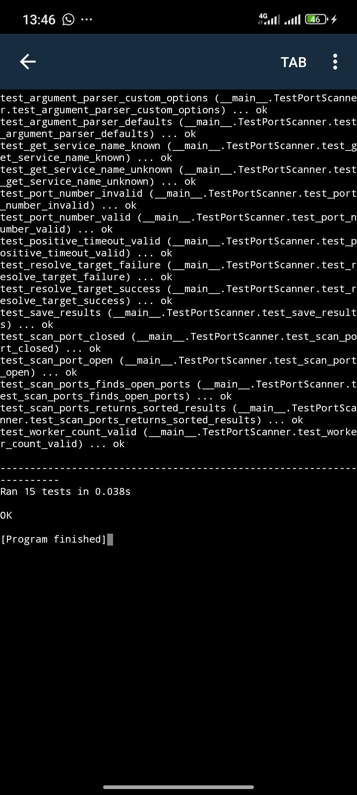
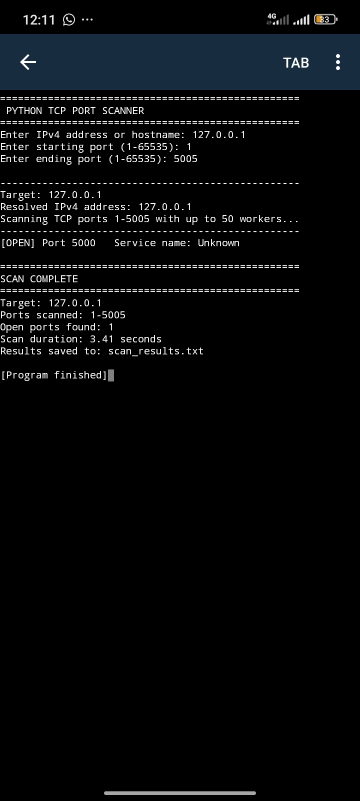
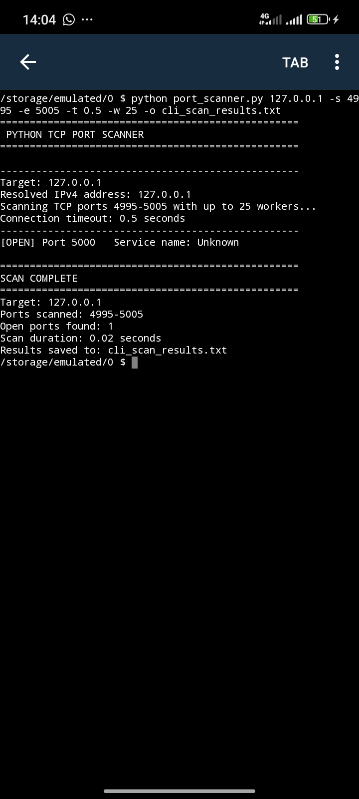

# Python TCP Port Scanner

A Python-based TCP port scanner developed as a cybersecurity learning project.

The tool scans a user-defined range of TCP ports, identifies open ports, looks up common service names using standard TCP port mappings, measures scan duration, and saves the results to a text report.

## Project Purpose

This project was created to develop practical understanding of:

- TCP/IP networking
- Network ports
- Socket programming
- Network reconnaissance
- Service-name lookup
- Input validation
- Error handling
- Basic network security assessment

## Features

- IPv4 address scanning
- Hostname support
- Configurable TCP port ranges
- TCP connect scanning
- Open-port detection
- Basic service-name lookup using standard TCP port mappings
- Connection timeout handling
- Input validation
- Error handling
- Scan-duration measurement
- Automatic result reporting
- Results saved to `scan_results.txt`
- Concurrent TCP port scanning using up to 50 worker threads.

## Technologies

- Python 3
- Socket programming
- TCP/IP networking
- Python standard library

No external packages are required.

## Project Structure

```text
Python-TCP-Port-Scanner/
│
├── .gitignore
├── LICENSE
├── README.md
└── port_scanner.py
```

## File Overview

- `port_scanner.py` — Main Python script containing the TCP port-scanning functionality.
- `README.md` — Project documentation, installation instructions, usage examples, and development notes.
- `.gitignore` — Prevents unnecessary files from being tracked by Git.
- `LICENSE` — MIT License for the project.

## Installation

```bash
git clone https://github.com/JohnOgye/Python-TCP-Port-Scanner.git
```
```bash
cd Python-TCP-Port-Scanner
```

## Usage

Run the program and enter an IP address or hostname.
Example:
Enter IP address or hostname: 127.0.0.1
Enter starting port (1-65535): 1
Enter ending port (1-65535): 1000
The scanner tests every TCP port in the selected range.
Example output (illustrative):
Target: 127.0.0.1
IP address: 127.0.0.1
Scanning TCP ports 1-1000...

[OPEN] Port 80     Service: http
[OPEN] Port 443    Service: https

==================================================
SCAN COMPLETE
==================================================
Target: 127.0.0.1
Ports scanned: 1-1000
Open ports found: 2
Scan duration: 2.31 seconds
Results saved to: scan_results.txt

1. Accepts an IPv4 address or hostname from the user.
2. Validates the target and requested port range.
3. Resolves hostnames to IPv4 addresses when necessary.
4. Attempts a TCP connection to each port in the selected range.
5. Identifies ports that accept TCP connections.
6. Looks up the standard service name associated with each open port.
7. Measures the total scan duration.
8. Saves the scan results to `scan_results.txt`.

## How It Works

1. Accepts an IPv4 address or hostname from the user.
2. Validates the target and requested port range.
3. Resolves hostnames to IPv4 addresses when necessary.
4. Attempts a TCP connection to each port in the selected range.
5. Identifies ports that accept TCP connections.
6. Looks up the standard service name associated with each open port.
7. Measures the total scan duration.
8. Saves the scan results to `scan_results.txt`.

## Testing

The scanner was tested in a controlled localhost environment using `127.0.0.1`.

### Test 1 — Baseline Scan

A baseline scan was performed before starting the local TCP test server.

The scanner scanned TCP ports `1-5005` and completed without detecting any open ports.

```text
Ports scanned: 1-5005
Open ports found: 0
Scan duration: 3.83 seconds
Results saved to: scan_results.txt
```



#### Baseline Scan Report



### Test 2 — Controlled Open-Port Test

A local TCP test server was started on `127.0.0.1:5000`.

The scanner was then run against TCP ports `1-5000` and successfully detected port `5000` as open.

```text
[OPEN] Port 5000   Service name: Unknown

SCAN COMPLETE
Target: 127.0.0.1
Ports scanned: 1-5000
Open ports found: 1
Scan duration: 4.21 seconds
Results saved to: scan_results.txt
```



#### Controlled Scan Report



The comparison demonstrates that the scanner correctly distinguishes between a baseline state with no detected open ports and a controlled environment containing a known open TCP port.

## Security & Ethical Use

This project is intended for cybersecurity education, authorized security testing, and network administration.

Only scan systems and networks that you own or have explicit permission to test.

Unauthorized port scanning may violate organizational policies, terms of service, or applicable laws.

The author is not responsible for misuse of this tool.

## Limitations

- TCP connect scanning only
- IPv4 only
- Sequential port scanning
- Service names are based on standard port mappings and do not confirm the actual remote service
- No UDP scanning
- No operating system detection
- No vulnerability detection or exploitation
- Scan speed depends on the selected port range, network conditions, and timeout settings.

## Future Improvements

- Add command-line arguments
- Add configurable connection timeouts
- Add CSV and JSON result export
- Add scan progress indicators
- Add IPv6 support
- Improve service identification using banner grabbing
- Add UDP scanning.

## Development Progress

This project was developed incrementally as part of my cybersecurity learning journey.

### Phase 1 — Basic Port Scanner

- Implemented TCP socket connections
- Scanned a basic range of TCP ports
- Tested against localhost (`127.0.0.1`)

### Phase 2 — Scanner Improvements

- Added hostname support
- Added configurable TCP port ranges
- Added input validation
- Added error handling
- Added basic service-name lookup using standard TCP port mappings
- Added scan-duration measurement
- Added automatic result-file generation

### Phase 3 — Local Testing

A local TCP test server was created on `127.0.0.1:5000` to provide a controlled environment for testing.

The scanner successfully detected the test server's open TCP port.

### Phase 4 — Documentation

- Added a structured project README
- Added an MIT License
- Added `.gitignore`
- Documented project features and limitations
- Documented ethical and authorized use
- Documented future improvements

### Phase 5 — Code Refinement

- Replaced `time.time()` with `time.perf_counter()` for reliable elapsed-time measurement
- Separated service-name lookup into its own function
- Improved socket and file error handling
- Added graceful scan interruption with `Ctrl+C`
- Added reusable constants for timeout, report filename, and output formatting
- Improved code readability and documentation
- Clarified IPv4 support and service-name lookup behavior

### Phase 6 — Unit Testing

- Added automated tests using Python's `unittest` framework
- Tested successful and failed hostname resolution
- Tested known and unknown service-name lookups
- Tested open-port detection
- Tested closed-port handling
- Tested scan-result file generation
- Used mocks to test socket-related behavior without relying on external systems
- Successfully passed all 15 automated tests.

#### Unit Test Results

All 15 automated tests completed successfully, including tests for concurrent scanning, command-line argument parsing, and input validation.



### Phase 7 — Concurrent Scanning

- Added concurrent TCP port scanning using `ThreadPoolExecutor`
- Added a maximum worker limit of 50 threads
- Allows multiple TCP connection attempts to run concurrently
- Preserved existing open-port and service-name lookup behavior
- Sorted detected open ports before displaying results
- Successfully detected the controlled localhost test server on TCP port `5000`
- Completed the observed concurrent scan of ports `1-5005` in 3.41 seconds

#### Concurrent Scan Result

The concurrent scanner successfully detected the controlled test server running on `127.0.0.1:5000`.



### Phase 8 — Command-Line Arguments

- Added command-line argument support using Python's `argparse`
- Added optional target specification from the command line
- Added configurable starting and ending TCP ports
- Added configurable connection timeout
- Added configurable worker-thread count
- Added configurable output report filename
- Preserved interactive mode when command-line arguments are not supplied
- Added validation for ports, timeout values, and worker counts
- Successfully passed all 15 automated tests

#### Command-Line Test Result

The scanner was successfully executed from the command line using a custom port range, timeout, worker count, and output filename.

Example command:

```bash
python port_scanner.py 127.0.0.1 -s 4995 -e 5005 -t 0.5 -w 25 -o cli_scan_results.txt
```

The controlled localhost TCP server on port `5000` was successfully detected.



## Author

Developed by Ogye Matthew John as a cybersecurity learning project.

## License

This project is licensed under the MIT License. See the `LICENSE` file for details.

